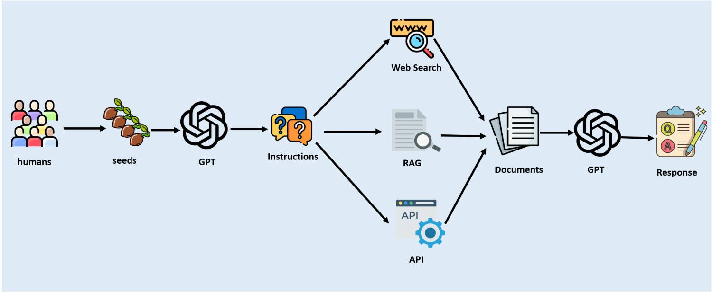

# SearchInstruct

**SearchInstruct** is a powerful tool for generating instruction datasets by leveraging seed instructions and generating similar variations. This repository provides a framework for creating diversified instruction datasets that can be used in various natural language processing (NLP) applications.

## Features

- **Seed Instruction Generation**: Start with a set of seed instructions and automatically generate a wide array of similar instructions.
- **Response Generation**: Utilize several tools to generate responses for the produced instructions, including:
  - **Retrieval-Augmented Generation (RAG)**: Integrate retrieval techniques to improve response quality.
  - **Web Search**: Fetch real-time data and responses through web searches.
  - **API Calls**: Make structured API calls to extract information and generate responses based on the generated instructions.
- **Customizable Pipeline**: Adjust the parameters and tools used in the instruction and response generation process to fit your specific use case.

## Use Cases

- **Creating Diverse Instruction Datasets**: Perfect for researchers and developers looking to create extensive datasets for training and testing language models.
- **Enhancing Conversational Agents**: Improve the quality of interactions in chatbots and other conversational interfaces by utilizing varied instructional inputs.
- **Experimentation and Research**: Useful for academic and industrial research focused on instruction-following AI systems.

## Getting Started

To get started with **SearchInstruct**, clone the repository and install the necessary dependencies. Configure the seed instructions and tools according to your needs, then run the included scripts to generate your instruction dataset and responses.

## Contributing

We welcome contributions from the community! Please see the [Contribution Guidelines](CONTRIBUTING.md) for more information on how to get involved.
